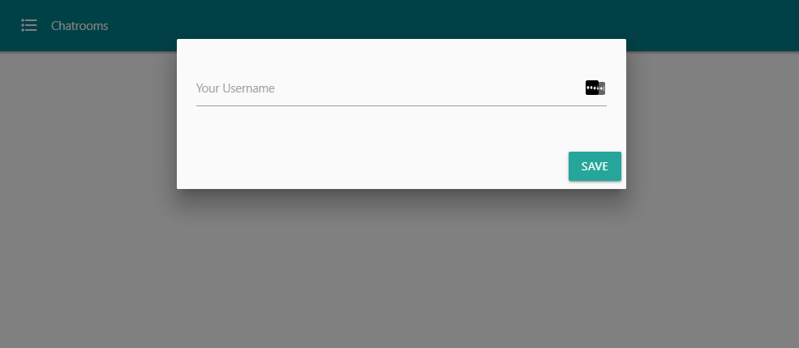
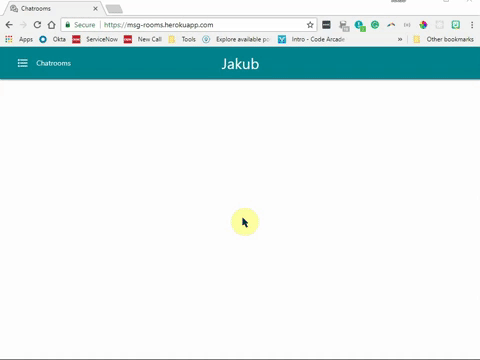
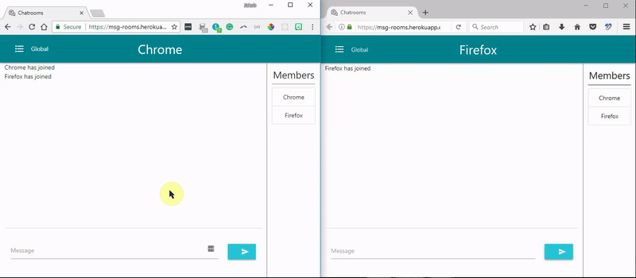
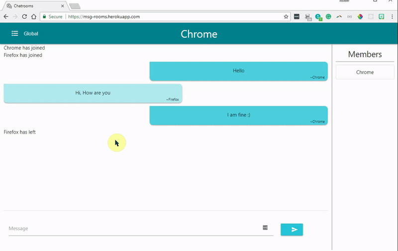

# Real Time Chatrooms App

#### [Demo on Heroku](https://msg-rooms.herokuapp.com/ "chatrooms - deployed")

Technologies used:
* Frontend: Vanilla JS + [SocketIO](https://socket.io/docs/ "SocketIO docs")
* CSS framework: [MaterializeCSS](https://materializecss.com/ "MaterializeCSS docs")
* Backend: Python - Flask + [flask-SocketIO](http://flask-socketio.readthedocs.io/en/latest/ "flask-socketIO docs")
* Data is stored server-side in a Python dictionary. No database used.

___
### Overview

* When App is opened first time, user is prompted to set up an Username

* Enter left Navbar for changing a chatroom 

* Real Time chat

* Creating new chatroom

___
**CSS Framework: [Materializecss](https://materializecss.com/ "materializecss framework")**